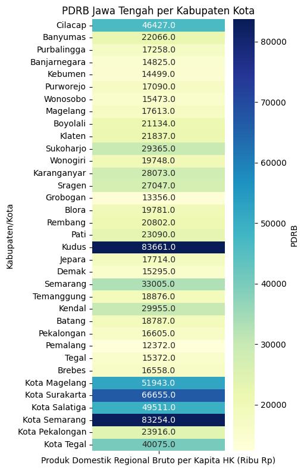
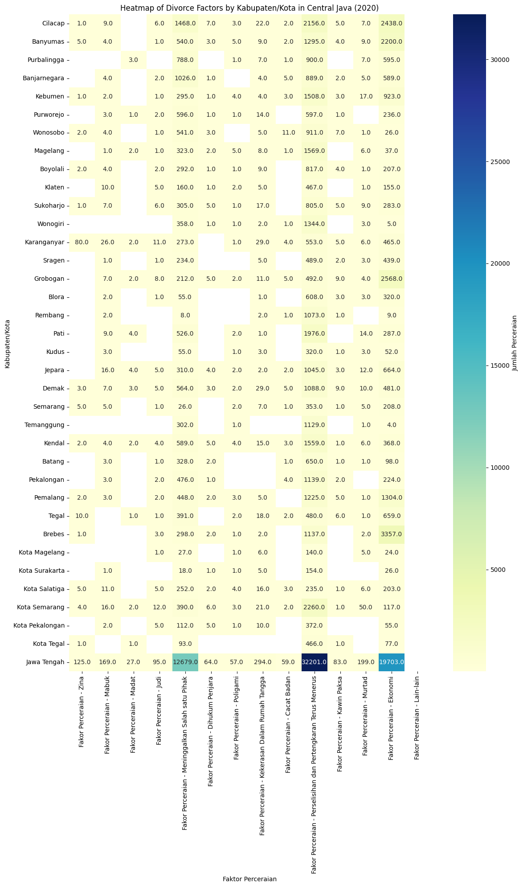

Mulai Notebook dengan memasukkan pustaka yang diperlukan


```python
import pandas as pd
import matplotlib.pyplot as plt
import seaborn as sns
```

    Matplotlib is building the font cache; this may take a moment.


```python
df_perceraian = pd.read_csv('/Users/fn/Documents/Data Science/dataset/perceraian/Jumlah Perceraian Menurut Kabupaten_Kota dan Faktor di Provinsi Jawa Tengah, 2020.csv')
print(df_perceraian)
```

         Kabupaten/Kota  Fakor Perceraian - Zina  Fakor Perceraian - Mabuk  \
    0           Cilacap                      1.0                       9.0   
    1          Banyumas                      5.0                       4.0   
    2       Purbalingga                      NaN                       NaN   
    3      Banjarnegara                      NaN                       4.0   
    4           Kebumen                      1.0                       2.0   
    5         Purworejo                      NaN                       3.0   
    6          Wonosobo                      2.0                       4.0   
    7          Magelang                      NaN                       1.0   
    8          Boyolali                      2.0                       4.0   
    9            Klaten                      NaN                      10.0   
    10        Sukoharjo                      1.0                       7.0   
    11         Wonogiri                      NaN                       NaN   
    12      Karanganyar                     80.0                      26.0   
    13           Sragen                      NaN                       1.0   
    14         Grobogan                      NaN                       7.0   
    15            Blora                      NaN                       2.0   
    16          Rembang                      NaN                       2.0   
    17             Pati                      NaN                       9.0   
    18            Kudus                      NaN                       3.0   
    19           Jepara                      NaN                      16.0   
    20            Demak                      3.0                       7.0   
    21         Semarang                      5.0                       5.0   
    22       Temanggung                      NaN                       NaN   
    23           Kendal                      2.0                       4.0   
    24           Batang                      NaN                       3.0   
    25       Pekalongan                      NaN                       3.0   
    26         Pemalang                      2.0                       3.0   
    27            Tegal                     10.0                       NaN   
    28           Brebes                      1.0                       NaN   
    29    Kota Magelang                      NaN                       NaN   
    30   Kota Surakarta                      NaN                       1.0   
    31    Kota Salatiga                      5.0                      11.0   
    32    Kota Semarang                      4.0                      16.0   
    33  Kota Pekalongan                      NaN                       2.0   
    34       Kota Tegal                      1.0                       NaN   
    35      Jawa Tengah                    125.0                     169.0   
    
        Fakor Perceraian - Madat  Fakor Perceraian - Judi  \
    0                        NaN                      6.0   
    1                        NaN                      1.0   
    2                        3.0                      NaN   
    3                        NaN                      2.0   
    4                        NaN                      1.0   
    5                        1.0                      2.0   
    6                        NaN                      1.0   
    7                        2.0                      1.0   
    8                        NaN                      2.0   
    9                        NaN                      5.0   
    10                       NaN                      6.0   
    11                       NaN                      NaN   
    12                       2.0                     11.0   
    13                       NaN                      1.0   
    14                       2.0                      8.0   
    15                       NaN                      1.0   
    16                       NaN                      NaN   
    17                       4.0                      NaN   
    18                       NaN                      NaN   
    19                       4.0                      5.0   
    20                       3.0                      5.0   
    21                       NaN                      1.0   
    22                       NaN                      NaN   
    23                       2.0                      4.0   
    24                       NaN                      1.0   
    25                       NaN                      2.0   
    26                       NaN                      2.0   
    27                       1.0                      1.0   
    28                       NaN                      3.0   
    29                       NaN                      1.0   
    30                       NaN                      NaN   
    31                       NaN                      5.0   
    32                       2.0                     12.0   
    33                       NaN                      5.0   
    34                       1.0                      NaN   
    35                      27.0                     95.0   
    
        Fakor Perceraian - Meninggalkan Salah satu Pihak  \
    0                                               1468   
    1                                                540   
    2                                                788   
    3                                               1026   
    4                                                295   
    5                                                596   
    6                                                541   
    7                                                323   
    8                                                292   
    9                                                160   
    10                                               305   
    11                                               358   
    12                                               273   
    13                                               234   
    14                                               212   
    15                                                55   
    16                                                 8   
    17                                               526   
    18                                                55   
    19                                               310   
    20                                               564   
    21                                                26   
    22                                               302   
    23                                               589   
    24                                               328   
    25                                               476   
    26                                               448   
    27                                               391   
    28                                               298   
    29                                                27   
    30                                                18   
    31                                               252   
    32                                               390   
    33                                               112   
    34                                                93   
    35                                             12679   
    
        Fakor Perceraian - Dihukum Penjara  Fakor Perceraian - Poligami  \
    0                                  7.0                          3.0   
    1                                  3.0                          5.0   
    2                                  NaN                          1.0   
    3                                  1.0                          NaN   
    4                                  1.0                          4.0   
    5                                  1.0                          1.0   
    6                                  3.0                          NaN   
    7                                  2.0                          5.0   
    8                                  1.0                          1.0   
    9                                  1.0                          2.0   
    10                                 5.0                          1.0   
    11                                 1.0                          1.0   
    12                                 NaN                          1.0   
    13                                 NaN                          NaN   
    14                                 5.0                          2.0   
    15                                 NaN                          NaN   
    16                                 NaN                          NaN   
    17                                 NaN                          2.0   
    18                                 NaN                          1.0   
    19                                 4.0                          2.0   
    20                                 3.0                          2.0   
    21                                 NaN                          2.0   
    22                                 NaN                          1.0   
    23                                 5.0                          4.0   
    24                                 2.0                          NaN   
    25                                 1.0                          NaN   
    26                                 2.0                          3.0   
    27                                 NaN                          2.0   
    28                                 2.0                          1.0   
    29                                 NaN                          1.0   
    30                                 1.0                          1.0   
    31                                 2.0                          4.0   
    32                                 6.0                          3.0   
    33                                 5.0                          1.0   
    34                                 NaN                          NaN   
    35                                64.0                         57.0   
    
        Fakor Perceraian - Kekerasan Dalam Rumah Tangga  \
    0                                              22.0   
    1                                               9.0   
    2                                               7.0   
    3                                               4.0   
    4                                               4.0   
    5                                              14.0   
    6                                               5.0   
    7                                               8.0   
    8                                               9.0   
    9                                               5.0   
    10                                             17.0   
    11                                              2.0   
    12                                             29.0   
    13                                              5.0   
    14                                             11.0   
    15                                              1.0   
    16                                              2.0   
    17                                              1.0   
    18                                              3.0   
    19                                              2.0   
    20                                             29.0   
    21                                              7.0   
    22                                              NaN   
    23                                             15.0   
    24                                              NaN   
    25                                              NaN   
    26                                              5.0   
    27                                             18.0   
    28                                              2.0   
    29                                              6.0   
    30                                              5.0   
    31                                             16.0   
    32                                             21.0   
    33                                             10.0   
    34                                              NaN   
    35                                            294.0   
    
        Fakor Perceraian - Cacat Badan  \
    0                              2.0   
    1                              2.0   
    2                              1.0   
    3                              5.0   
    4                              3.0   
    5                              NaN   
    6                             11.0   
    7                              1.0   
    8                              NaN   
    9                              NaN   
    10                             NaN   
    11                             1.0   
    12                             4.0   
    13                             NaN   
    14                             5.0   
    15                             NaN   
    16                             1.0   
    17                             NaN   
    18                             NaN   
    19                             2.0   
    20                             5.0   
    21                             1.0   
    22                             NaN   
    23                             3.0   
    24                             1.0   
    25                             4.0   
    26                             NaN   
    27                             2.0   
    28                             NaN   
    29                             NaN   
    30                             NaN   
    31                             3.0   
    32                             2.0   
    33                             NaN   
    34                             NaN   
    35                            59.0   
    
        Fakor Perceraian - Perselisihan dan Pertengkaran Terus Menerus  \
    0                                                2156                
    1                                                1295                
    2                                                 900                
    3                                                 889                
    4                                                1508                
    5                                                 597                
    6                                                 911                
    7                                                1569                
    8                                                 817                
    9                                                 467                
    10                                                805                
    11                                               1344                
    12                                                553                
    13                                                489                
    14                                                492                
    15                                                608                
    16                                               1073                
    17                                               1976                
    18                                                320                
    19                                               1045                
    20                                               1088                
    21                                                353                
    22                                               1129                
    23                                               1559                
    24                                                650                
    25                                               1139                
    26                                               1225                
    27                                                480                
    28                                               1137                
    29                                                140                
    30                                                154                
    31                                                235                
    32                                               2260                
    33                                                372                
    34                                                466                
    35                                              32201                
    
        Fakor Perceraian - Kawin Paksa  Fakor Perceraian - Murtad  \
    0                              5.0                        7.0   
    1                              4.0                        9.0   
    2                              NaN                        7.0   
    3                              2.0                        5.0   
    4                              3.0                       17.0   
    5                              1.0                        NaN   
    6                              7.0                        1.0   
    7                              NaN                        6.0   
    8                              4.0                        1.0   
    9                              NaN                        1.0   
    10                             5.0                        9.0   
    11                             NaN                        3.0   
    12                             5.0                        6.0   
    13                             2.0                        3.0   
    14                             9.0                        4.0   
    15                             3.0                        3.0   
    16                             1.0                        NaN   
    17                             NaN                       14.0   
    18                             1.0                        3.0   
    19                             3.0                       12.0   
    20                             9.0                       10.0   
    21                             1.0                        5.0   
    22                             NaN                        1.0   
    23                             1.0                        6.0   
    24                             1.0                        1.0   
    25                             2.0                        NaN   
    26                             5.0                        1.0   
    27                             6.0                        1.0   
    28                             NaN                        2.0   
    29                             NaN                        5.0   
    30                             NaN                        NaN   
    31                             1.0                        6.0   
    32                             1.0                       50.0   
    33                             NaN                        NaN   
    34                             1.0                        NaN   
    35                            83.0                      199.0   
    
        Fakor Perceraian - Ekonomi  Fakor Perceraian - Lain-lain  \
    0                         2438                           NaN   
    1                         2200                           NaN   
    2                          595                           NaN   
    3                          589                           NaN   
    4                          923                           NaN   
    5                          236                           NaN   
    6                           26                           NaN   
    7                           37                           NaN   
    8                          207                           NaN   
    9                          155                           NaN   
    10                         283                           NaN   
    11                           5                           NaN   
    12                         465                           NaN   
    13                         439                           NaN   
    14                        2568                           NaN   
    15                         320                           NaN   
    16                           9                           NaN   
    17                         287                           NaN   
    18                          52                           NaN   
    19                         664                           NaN   
    20                         481                           NaN   
    21                         208                           NaN   
    22                           4                           NaN   
    23                         368                           NaN   
    24                          98                           NaN   
    25                         224                           NaN   
    26                        1304                           NaN   
    27                         659                           NaN   
    28                        3357                           NaN   
    29                          24                           NaN   
    30                          26                           NaN   
    31                         203                           NaN   
    32                         117                           NaN   
    33                          55                           NaN   
    34                          77                           NaN   
    35                       19703                           NaN   
    
        Fakor Perceraian - Jumlah  
    0                        6124  
    1                        4077  
    2                        2302  
    3                        2527  
    4                        2762  
    5                        1452  
    6                        1512  
    7                        1955  
    8                        1340  
    9                         806  
    10                       1444  
    11                       1715  
    12                       1455  
    13                       1174  
    14                       3325  
    15                        993  
    16                       1096  
    17                       2819  
    18                        438  
    19                       2069  
    20                       2209  
    21                        614  
    22                       1437  
    23                       2562  
    24                       1085  
    25                       1851  
    26                       3000  
    27                       1571  
    28                       4803  
    29                        204  
    30                        206  
    31                        743  
    32                       2884  
    33                        562  
    34                        639  
    35                      65755  


```python
df_pdrb = pd.read_csv('/Users/fn/Downloads/Produk Domestik Regional Bruto per Kapita Atas Dasar Harga Konstan 2010 Menurut Kabupaten_Kota di Provinsi Jawa Tengah (ribu rupiah), 2020.csv', decimal='.')
df_pdrb['Kabupaten/Kota'] = df_pdrb['Kabupaten/Kota'].str.title()
df_pdrb['Produk Domestik Regional Bruto per Kapita HK (Ribu Rp)'] = pd.to_numeric(df_pdrb['Produk Domestik Regional Bruto per Kapita HK (Ribu Rp)'], errors='coerce')
print(df_pdrb)
```

         Kabupaten/Kota  Produk Domestik Regional Bruto per Kapita HK (Ribu Rp)
    0           Cilacap                                              46427     
    1          Banyumas                                              22066     
    2       Purbalingga                                              17258     
    3      Banjarnegara                                              14825     
    4           Kebumen                                              14499     
    5         Purworejo                                              17090     
    6          Wonosobo                                              15473     
    7          Magelang                                              17613     
    8          Boyolali                                              21134     
    9            Klaten                                              21837     
    10        Sukoharjo                                              29365     
    11         Wonogiri                                              19748     
    12      Karanganyar                                              28073     
    13           Sragen                                              27047     
    14         Grobogan                                              13356     
    15            Blora                                              19781     
    16          Rembang                                              20802     
    17             Pati                                              23090     
    18            Kudus                                              83661     
    19           Jepara                                              17714     
    20            Demak                                              15295     
    21         Semarang                                              33005     
    22       Temanggung                                              18876     
    23           Kendal                                              29955     
    24           Batang                                              18787     
    25       Pekalongan                                              16605     
    26         Pemalang                                              12372     
    27            Tegal                                              15372     
    28           Brebes                                              16558     
    29    Kota Magelang                                              51943     
    30   Kota Surakarta                                              66655     
    31    Kota Salatiga                                              49511     
    32    Kota Semarang                                              83254     
    33  Kota Pekalongan                                              23916     
    34       Kota Tegal                                              40075     


```python
# Setting up the heatmap visualization
plt.figure(figsize=(5, 8))

# Creating a pivot table for the heatmap
heatmap_data = df_pdrb.set_index('Kabupaten/Kota')

# Creating the heatmap
sns.heatmap(heatmap_data, annot=True, fmt='.1f', cmap='YlGnBu', cbar_kws={'label': 'PDRB'})
plt.title('PDRB Jawa Tengah per Kabupaten Kota')
plt.tight_layout()

# Displaying the heatmap
plt.show()
```


    

    


```python
# Setting up the heatmap visualization
plt.figure(figsize=(12, 20))

# Creating a pivot table for the heatmap
heatmap_data = df_perceraian.set_index('Kabupaten/Kota').drop(columns=['Fakor Perceraian - Jumlah'])

# Creating the heatmap
sns.heatmap(heatmap_data, annot=True, fmt='.1f', cmap='YlGnBu', cbar_kws={'label': 'Jumlah Perceraian'})
plt.title('Heatmap of Divorce Factors by Kabupaten/Kota in Central Java (2020)')
plt.xlabel('Faktor Perceraian')
plt.ylabel('Kabupaten/Kota')
plt.tight_layout()

# Displaying the heatmap
plt.show()
```


    

    


```python
# Setting up the heatmap visualization
plt.figure(figsize=(12, 20))

# Creating a pivot table for the heatmap
heatmap_data = df_perceraian.set_index('Kabupaten/Kota').drop(columns=['Fakor Perceraian - Jumlah'])

# Creating the heatmap
sns.heatmap(heatmap_data, annot=True, fmt='.1f', cmap='YlGnBu', cbar_kws={'label': 'Jumlah Perceraian'})
plt.title('Heatmap of Divorce Factors by Kabupaten/Kota in Central Java (2020)')
plt.xlabel('Faktor Perceraian')
plt.ylabel('Kabupaten/Kota')
plt.tight_layout()

# Displaying the heatmap
plt.show()
```


    

    


```python

```
